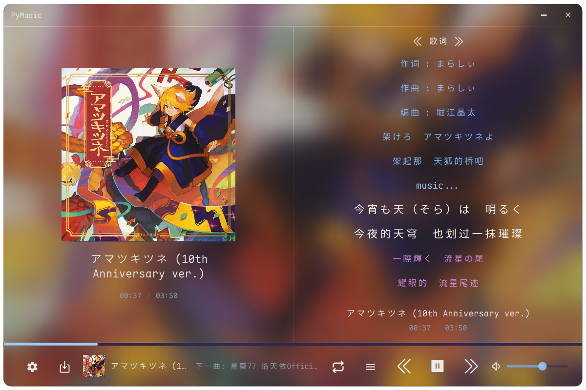
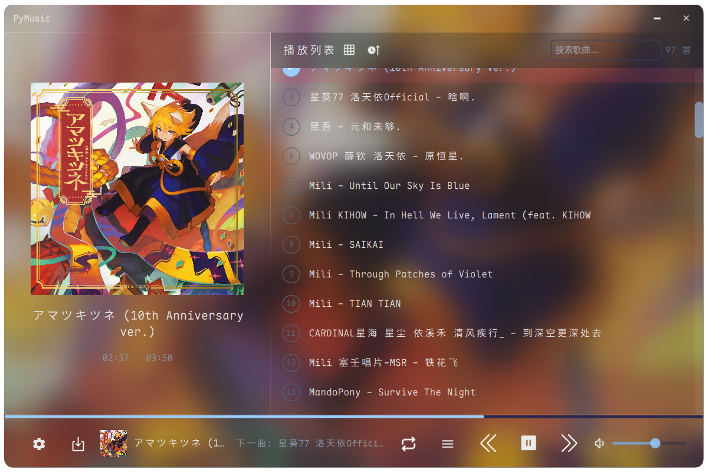
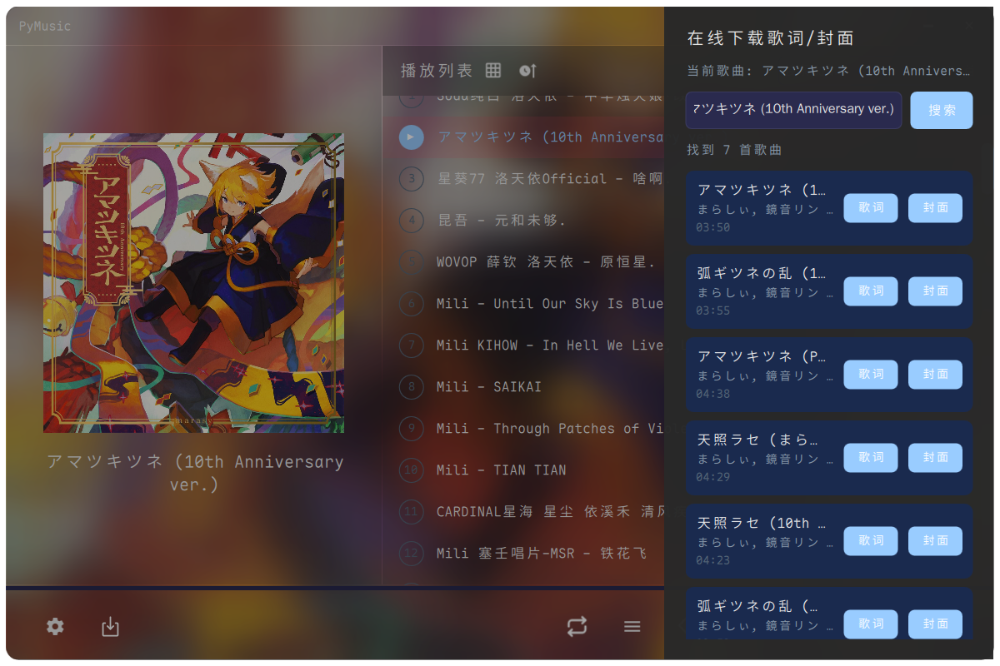
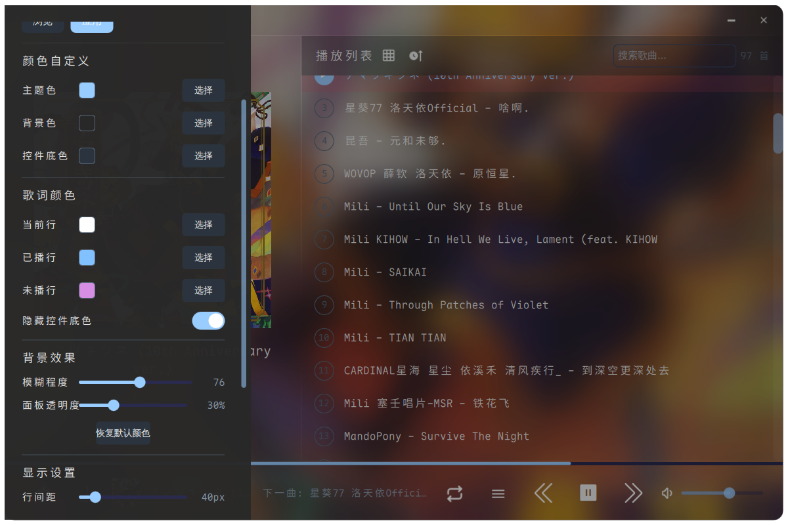

# 如仓库名字所见，这是一个完全由AI代理编写的软件
（前景提要）

我从Windows转到Linux后，我不喜欢Mpv和vlc的界面，也只想要一个好用的播放器，但是我很喜欢的播放器 [MusicPlayer2](https://github.com/zhongyang219/MusicPlayer2) 并不支持linux,所以我使用AI写了一个替代品
（注: 该播放器在Kde上的稳定性是可控的，Gnome和其他De/wm行为目前不可预测）

# PyMusic---基于PySide+Qt6实现的播放器

该播放器底层为ffplay，目前支持以下功能

1:Api拉取歌词与封面

2:卡片视图与列表视图

## 播放器行为

播放器会在启动时默认扫描 /home/user/Music下的歌曲（可在设置中更改）

拉取歌词/封面时会保存到和歌曲同目录下的歌名.lrc或歌名.jpg/png

## 占用

裸跑软件适内存占用为900mb+，这是pyside6+Qt的固定开销（我没招了）

# 以下是预览图片

